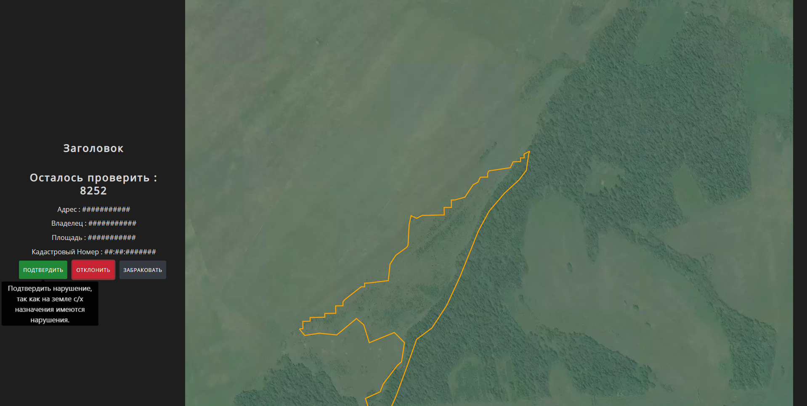

# GIS Demo

## About this app

This is a demo of a GIS for automated detection and recognition of unattended or abandoned farmlands. 
It is built using Python with Google Earth Engine for accessing satellite data, Plotly's graphing library for maps and Dash framework for web applications.

## How to run this app

(The following instructions apply to Windows command line.)

To run this app first clone repository and then open a terminal to the app folder.

```
git clone https://github.com/teploe-odealko/mirs_pk_hack.git
cd mirs_pk_hack/
```

Create and activate a new virtual environment (recommended) by running
the following:

On Windows

```
virtualenv venv 
\venv\scripts\activate
```

Or if using linux

```bash
python3 -m venv myvenv
source myvenv/bin/activate
```

Install the requirements:

```
pip install -r requirements.txt
```
Run the app:

```
python app.py
```
You can run the app on your browser at http://127.0.0.1:8888


## Screenshots



## Resources

To learn more about Dash, please visit [documentation](https://plot.ly/dash).
To learn more about dash-bootstrap visit [documentation](https://dash-bootstrap-components.opensource.faculty.ai/).